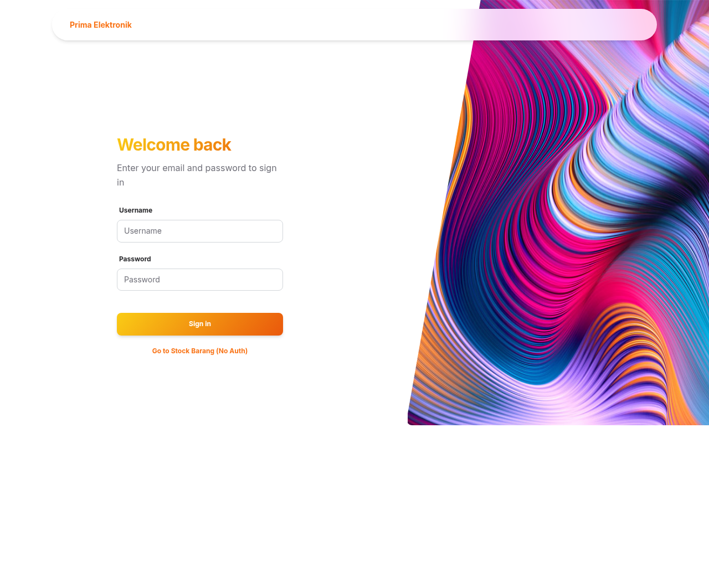
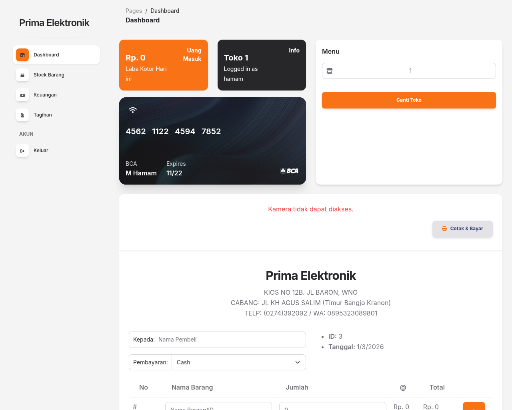
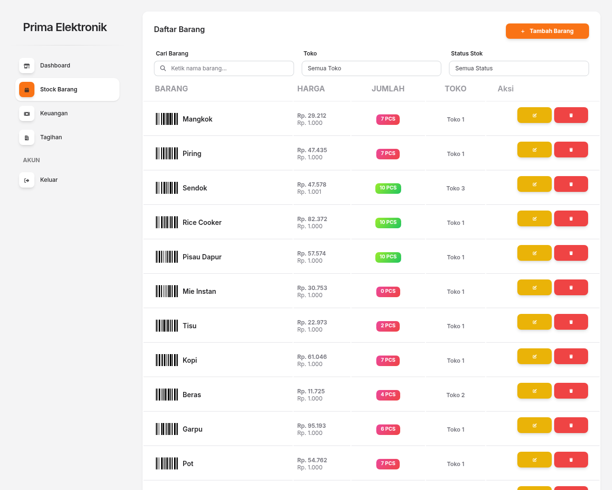
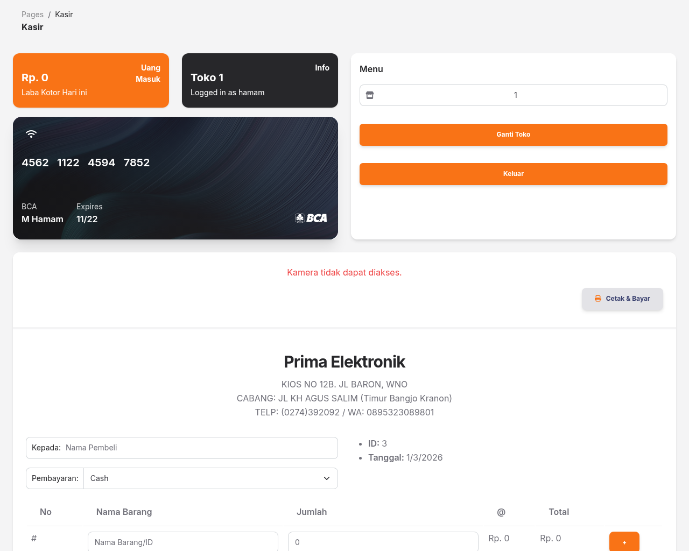
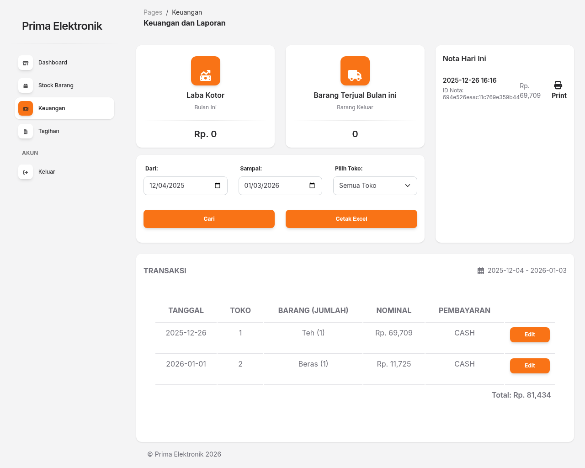
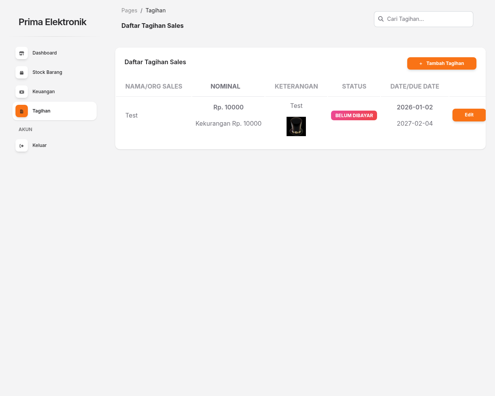

# ⚡ Simpos - Spring Boot Retail Management Project

**Simpos** is a robust, full-stack Point of Sale system built with **Spring Boot 3** and **MongoDB**. It is designed as a lightweight yet comprehensive solution for small electronics retailers, implementing a multi-role (Admin/Cashier) architecture with real-time stock reconciliation, financial reporting, and integrated document management.


---

Explore the comprehensive features of **Simpos** through our gallery.

| | |
|:---:|:---:|
| <br>**Authentication Gateway** | <br>**Administrative Dashboard** |
| <br>**Inventory Management** | <br>**POS Transaction Interface** |
| <br>**Financial Reporting** | <br>**Digital Receipt / Invoice** |

---

## 🏗️ Technical Architecture

### Backend: Spring Boot 3
- **Spring Data MongoDB**: Implements a NoSQL data layer for high-flexibility product schemas and transaction logging.
- **Spring Security**: Role-based access control (RBAC) ensuring data isolation between administrative and cashier functions.
- **Maven Dependency Management**: Optimized build lifecycle for production-ready JAR deployment.

### Frontend: Thymeleaf Engine
- **Server-Side Rendering (SSR)**: Leveraging Thymeleaf for rapid UI generation with zero client-side framework overhead.
- **Bootstrap 5 UI**: Fully responsive grid system with custom CSS for a modern retail aesthetic.
- **Digital Proof Workflow**: Integrated file handling for uploading and storing payment receipt images directly into the transaction records.

### Key Functional Systems
- **Stock Controller**: Real-time inventory tracking with multi-location support and low-stock flagging.
- **Reporting Engine**: Dynamic transaction filtering by date/location with calculated gross profit (Laba Kotor) and volume metrics.
- **Export Services**: Server-side Excel generation using Apache POI for transaction data archiving.

---

## 🛠 Tech Stack

| Layer | Technology |
|---|---|
| **Backend Framework** | Spring Boot 3.2.4 |
| **Language** | Java 17 (LTS) |
| **Database** | MongoDB (NoSQL) |
| **Build Tool** | Maven |
| **Templating** | Thymeleaf |
| **Styling** | Bootstrap 5 + Vanilla CSS |
| **Reporting** | Apache POI (Excel) |

---

## 📂 Project Structure

```bash
/
├── src/
│   ├── main/
│   │   ├── java/        # Controller, Service, Repository, Model layers
│   │   └── resources/   # Thymeleaf templates, application.properties, static assets
│   └── test/           # Integration tests for transaction logic
├── screenshots/         # UI documentation
├── pom.xml              # Maven dependency and build config
└── README.md
```

---

## 📦 Getting Started

### Prerequisites
- **JDK 17+**
- **MongoDB** (running on port `27017`)
- **Maven** (optional, uses `mvnw` wrapper)

### Setup & Run
```bash
git clone https://github.com/widifirmaan/springboot-simple-pos.git
cd springboot-simple-pos

# Build and execute via Maven Wrapper
./mvnw clean package
./mvnw spring-boot:run
```
*Access via `http://localhost:8081`*

---

## 👥 Authors
Developed with ❤️ by **Widi Firmansyah**.

---

**Streamlining retail operations with modern tech** 🚀
